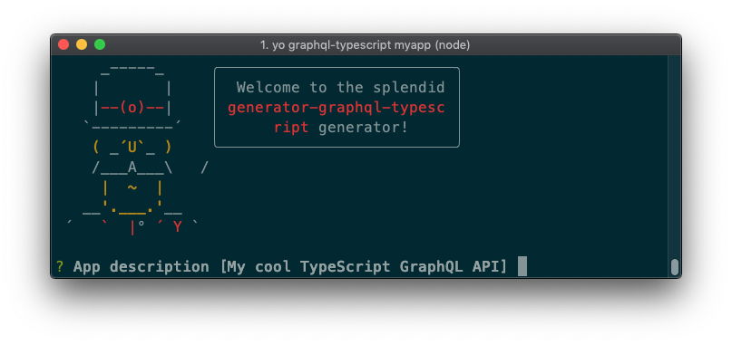

# generator-graphql-typescript [![NPM version][npm-image]][npm-url] [![Build Status][travis-image]][travis-url] [![Coverage percentage][coveralls-image]][coveralls-url]
> Create a Graphql API in typescript with [type-graphql](https://typegraphql.ml/) and [Typeorm](https://typeorm.io/#/)




## Installation

First, install [Yeoman](http://yeoman.io) and generator-rest-express-typescript using [npm](https://www.npmjs.com/) (we assume you have pre-installed [node.js](https://nodejs.org/)).

```bash
npm install -g yo
npm install -g generator-graphql-typescript
```

Then generate your new project:

```bash
yo graphql-typescript myapp
```
## Getting Started

* Run `npm start` to preview and watch for changes
* Run `npm run build` to create the production version
* Run `npm run test` to lauch jest test


## Queries

### Login

```graphql
query login(
    input: $input
  ) {
    ... on LoginType {
      __typename
      token
    }
    ... on UserError {
      __typename
      message
    }
  }
}
```

### Get projects

You need to put the token you get from the login query to perform this query. Prefix the authorization header with `bearer`.

```json
{
  "Authorization": "bearer thetoken"
}
```

```graphql
query {
  projects { 
    name,
    owner { email }
  }
} 
```

## Mutations

### Register

```graphql
mutation {
  register(
    input: $input
  ) {
    ... on User {
      __typename
      username
      email
    }
    ... on UserError {
      __typename
      message
    }
  }
}
```

### Add project

You need to put the token you get from the login query to perform this query. Prefix the authorization header with `bearer`.

```json
{
  "Authorization": "bearer thetoken"
}
```

```graphql
mutation {
  createProject(
    input: $input
  ) {
    __typename
    ... on Project {
      name
    }
    ... on UserError {
      message
    }
  }
}
```

## TODO 🚧  

* Add subcommand to create a new resolver

## Contribute

See the [contributing docs](contributing.md).

## License

MIT © [Clément Lafont](johnrazeur@gmail.com)


[npm-image]: https://badge.fury.io/js/generator-graphql-typescript.svg
[npm-url]: https://npmjs.org/package/generator-graphql-typescript
[travis-image]: https://travis-ci.org/johnrazeur/generator-graphql-typescript.svg?branch=master
[travis-url]: https://travis-ci.org/johnrazeur/generator-graphql-typescript
[coveralls-image]: https://coveralls.io/repos/johnrazeur/generator-graphql-typescript/badge.svg
[coveralls-url]: https://coveralls.io/r/johnrazeur/generator-graphql-typescript
